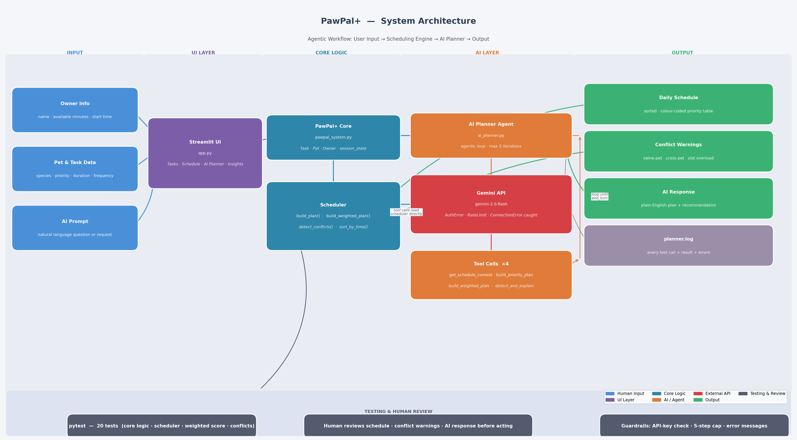

# PawPal+ — AI-Powered Pet Care Scheduler

> A smart daily scheduling assistant for pet owners, built with Python, Streamlit, and Gemini. The system plans your day around your pets' care needs, detects scheduling conflicts, and includes an AI planning agent that reasons over your live task data using tool calls.

---

## Original Project (Modules 1–3)

**PawPal+** was originally built in Module 2 as a Python + Streamlit pet-care scheduling app. The original goals were to let a pet owner enter basic info about their animals and daily tasks, then generate a prioritized daily care plan that fit within their available time. The core capabilities included priority-based scheduling, time-slot sorting (morning → afternoon → evening), per-pet filtering, conflict detection, and recurring tasks that automatically spawn the next occurrence when marked complete. Module 3 extended this with a weighted urgency scoring algorithm that accounts for priority tier, how many days overdue a task is, and whether the task is a quick win relative to available time.

---

## What This Project Does and Why It Matters

Managing multiple pets with different medications, feeding schedules, walks, and grooming appointments is genuinely difficult to track. Most to-do apps don't understand constraints like "I only have 90 minutes today" or "Luna's flea treatment is 3 days overdue." PawPal+ bridges that gap by combining a rule-based scheduling engine with an AI agent that can reason over your actual task data, explain its choices, and flag conflicts — all in plain English.

The AI Planner tab lets you ask questions like *"Plan my day"* or *"What should I prioritize?"* and receive a natural-language response built on top of live scheduling logic, not a generic answer. This makes the AI output grounded, specific, and actually useful.

---

## System Architecture



The system is organized into five layers that data flows through left-to-right:

**INPUT** — The owner provides their name and available daily time, pets are registered with species and age, and tasks are added with priority, duration, preferred time slot, and frequency. A natural-language prompt feeds separately into the AI layer.

**UI LAYER** — `app.py` is a Streamlit app with four tabs (Tasks, Schedule, AI Planner, Insights). All owner/pet/task state lives in `st.session_state` so nothing resets on rerun. The sidebar handles owner setup and pet management.

**CORE LOGIC** — `pawpal_system.py` contains all the scheduling logic: `Task`, `Pet`, and `Owner` are plain dataclasses; `Scheduler` holds the four main algorithms — `build_plan()` (priority-based), `build_weighted_plan()` (urgency-scored), `detect_conflicts()`, and `sort_by_time()`.

**AI LAYER** — `ai_planner.py` runs an agentic loop using the Google Gemini SDK. The agent is given four tools that call directly into the Scheduler methods. It calls `get_schedule_context` first to perceive the current state, picks a scheduling mode, builds the plan, then calls `detect_and_explain` to verify its own output before replying. The loop is capped at 5 iterations as a guardrail.

**OUTPUT** — The Schedule tab shows a colour-coded daily plan with conflict warnings and a skipped-tasks list. The AI Planner returns a plain-English response. Every agent run is logged to `planner.log`.

The **Testing & Review** strip at the bottom represents where humans interact with the system output — reading the schedule, reviewing AI recommendations before acting, and the 20-test pytest suite that validates the core scheduling logic.

---

## Setup Instructions

**Prerequisites:** Python 3.10+ and a free Gemini API key (get one at [aistudio.google.com](https://aistudio.google.com) → Get API Key — no credit card required).

```bash
# 1. Clone or download the project
git clone <your-repo-url>
cd ai110-module2show-pawpal-starter

# 2. Create and activate a virtual environment
python3 -m venv .venv
source .venv/bin/activate        # Windows: .venv\Scripts\activate

# 3. Install dependencies
pip install -r requirements.txt

# 4. Set up your API key
cp .env.example .env
# Open .env in any text editor and replace the placeholder:
#   GEMINI_API_KEY=AIza-your-key-here

# 5. Run the app
streamlit run app.py
```

The app opens at `http://localhost:8501`.

> **Note:** The Tasks, Schedule, and Insights tabs work without an API key. The AI Planner tab requires one and will show a clear warning message if it is missing.

**To run the test suite:**
```bash
python3 -m pytest tests/test_pawpal.py -v
```

**To run the evaluation harness:**
```bash
python3 eval.py            # summary report
python3 eval.py --verbose  # show expected vs actual detail per scenario
```

**To regenerate the system diagram:**
```bash
python3 generate_diagram.py
```

---

## Sample Interactions

The following examples show real inputs typed into the AI Planner tab and the kind of responses the agent produces. The agent calls live scheduling tools on your actual task data — it is not generating generic advice.

---

**Example 1 — Basic daily plan**

*Setup:* Owner Jordan, 90 minutes available. Max the dog has a 30-min morning walk (high priority) and a 20-min enrichment toy (low priority, afternoon). Luna the cat has a 5-min medication (high priority, morning, weekly, due today) and a 15-min brush (medium priority, evening).

*Prompt:* `Plan my day`

*AI Response:*
> Here's your plan for today, Jordan. I used the weighted scoring mode since Luna's Medication has a due date — it scores highest (115 pts) even though it only takes 5 minutes, so I've put that first.
>
> **Your schedule (85 min of 90 available):**
> Morning — Luna: Medication (5 min) · Max: Morning Walk (30 min)
> Afternoon — Max: Enrichment Toy (20 min)
> Evening — Luna: Brush Fur (15 min) · 15 min remaining
>
> No conflicts detected — your plan looks clean. One suggestion: since you have 5 minutes left, consider adding a short water-bowl check as a recurring task for tomorrow.

---

**Example 2 — Conflict scenario**

*Setup:* Same owner, but Max now also has a 15-min flea treatment added to the morning slot, creating two high-priority tasks for Max in the same time slot.

*Prompt:* `Are there any scheduling conflicts I should know about?`

*AI Response:*
> Yes — I found 2 conflicts after building your plan:
>
> 1. **[Max] morning slot overlap:** "Morning Walk" and "Flea Treatment" are both scheduled for Max in the morning. You can only do one at a time — I'd suggest moving Flea Treatment to afternoon since it has lower urgency than the walk.
>
> 2. **Cross-pet high-priority clash (morning):** Max's Morning Walk and Luna's Medication are both high-priority and both in the morning. They're for different pets so they don't technically block each other, but it does mean your morning will be busy — budget about 35 minutes before anything else.
>
> Everything fits in your 90 minutes with 10 to spare if you move Flea Treatment to afternoon.

---

**Example 3 — Overdue task prioritization**

*Setup:* Luna's weekly medication is 4 days overdue (`due_date = today - 4 days`). A new high-priority vet appointment (60 min) was just added.

*Prompt:* `I just added a vet visit — will everything still fit today?`

*AI Response:*
> With the 60-minute vet visit added, not everything fits in your 90 minutes. Here's what the weighted plan looks like:
>
> **Scheduled (90 min):**
> — Luna: Medication (5 min, score: 130 — overdue bonus applied)
> — Vet Visit (60 min, high priority)
> — Max: Morning Walk (30 min) ← uses your remaining 25 min... actually this is 95 min total, so Morning Walk gets skipped.
>
> **Skipped:** Max: Morning Walk (30 min) — didn't fit after the vet visit.
>
> Luna's Medication scores highest today because it's 4 days overdue (+20 bonus on top of the base). My suggestion: if the vet visit can move to tomorrow, Max's walk stays in the plan. Otherwise, consider a shorter walk (10–15 min) as a separate task.

---

## Design Decisions

**Why an agentic workflow instead of a simple API call?**
A single-shot prompt like "here are my tasks, make a schedule" would produce a generic answer. The agent approach lets Gemini *call the actual scheduler*, so the output is built on the same logic the manual Schedule tab uses — it's grounded in real data, not a hallucinated summary. The trade-off is added complexity (a loop, tool definitions, error handling) and slightly higher latency. For a daily planning tool used once a day, that trade-off is worth it.

**Why four tools, not one?**
Splitting the functionality into `get_schedule_context`, `build_priority_plan`, `build_weighted_plan`, and `detect_and_explain` lets the agent make decisions — it chooses weighted mode when tasks have due dates, priority mode when they don't. A single `plan_everything` tool would remove that decision-making and make the agentic loop pointless. The four-tool design also means each tool is testable in isolation.

**Why `pet_name` on `Task`?**
The scheduler's `build_plan()` flattens all tasks from all pets into one list. Without a back-reference, the daily plan would say "Morning Walk — 30 min" with no way to know which animal it belongs to. Adding `pet_name` as an optional field stamped by `Pet.add_task()` solved this cleanly without changing the data model.

**Why a `skipped` list on `Scheduler`?**
The original design only stored tasks that made it into the plan. Without tracking what was left out, `get_explanation()` couldn't tell the owner *why* something was missing — just that it was. The `skipped` list gives the explainability feature something to work with, and it's what feeds the "Skipped" table in the UI and the AI agent's awareness of overflow.

**Why `gemini-2.0-flash` as the default model?**
Flash is fast, free-tier friendly, and capable enough for tool-use workflows over structured JSON data. This is a student project where cost matters and the inputs are small (a few pets and tasks, not large documents). The model can be swapped to `gemini-2.0-pro` in `ai_planner.py` for more complex reasoning with no other code changes.

**Trade-off: time slot vs. minute-level precision**
The scheduler works in three named slots (morning, afternoon, evening) rather than tracking exact start and end times. This means it can flag that two tasks are "both in the morning" but can't tell you they overlap at 9:15 AM specifically. For a daily pet-care app where the owner needs a rough plan — not a calendar invite — that level of precision is appropriate. Adding minute-level scheduling would make the app significantly more complex without meaningful benefit for the target use case.

---

## Evaluation Harness (Stretch Feature)

`eval.py` is a standalone evaluation script that runs 12 predefined scenarios through the scheduling engine and prints a structured pass/fail report. No API key or running app required.

```
python3 eval.py            # summary view
python3 eval.py --verbose  # shows expected vs actual for every check
```

**Sample output:**
```
=================================================================
  PawPal+  —  Scheduling Engine Evaluation Harness
=================================================================
  12 scenarios  |  no API key required
=================================================================

  📋 SCHEDULING
    PASS ✓  [100%]  Priority ordering
    PASS ✓  [100%]  Time budget respected
    PASS ✓  [100%]  Overflow goes to skipped
    PASS ✓  [100%]  Empty schedule when all long
    PASS ✓  [100%]  sort_by_time order

  ⚖️  WEIGHTED
    PASS ✓  [100%]  Overdue outranks on-time
    PASS ✓  [100%]  Efficiency bonus applied
    PASS ✓  [100%]  Overdue bonus capped at 50
    PASS ✓  [100%]  No due_date = zero overdue

  ⚠️  CONFLICTS
    PASS ✓  [100%]  Same-pet same-slot flagged
    PASS ✓  [100%]  Slot overload flagged
    PASS ✓  [100%]  No false conflict diff slots

=================================================================
  RESULT:  12 / 12 passed  (100.0%)   ████████████████████

  Category breakdown:
    📋 Scheduling    5/5  ██████████
    ⚖️  Weighted      4/4  ██████████
    ⚠️  Conflicts     3/3  ██████████
=================================================================
```

**How it differs from the pytest suite:** The pytest tests are unit tests — they test one method at a time with minimal setup. The eval harness is scenario-based — each scenario sets up a realistic owner/pet/task state, runs the full scheduling pipeline end-to-end, and checks the output against a meaningful expected outcome. Each scenario also reports a confidence rating (the fraction of sub-checks that passed), so partial failures show up rather than a binary crash.

The script exits with code `0` if all scenarios pass and `1` if any fail, making it suitable for use in CI pipelines.

---

## Testing Summary

**What the test suite covers (20 tests, all passing):**
- Sorting correctness — tasks added in any order come out morning → afternoon → evening; tasks with no `preferred_time` always sort last
- Recurrence logic — daily tasks spawn tomorrow, weekly tasks spawn +7 days, one-off tasks produce nothing, a fresh pet has no pending tasks
- Conflict detection — same-pet slot clash, cross-pet high-priority clash, and slot overload all produce the correct warning strings
- Weighted scoring — priority base values, overdue bonus (capped at 50), efficiency bonus (+15 for quick tasks), zero overdue bonus when `due_date` is None, overdue medium outranking on-time high, and tasks that exceed time going to `skipped`

**What worked well:**
The test suite caught a real bug: the original weighted score formula silently returned 0 for tasks with `due_date=None` rather than explicitly skipping the overdue calculation. The fix (adding a `if task.due_date is not None` guard) was straightforward once the failing test made the problem visible. This is a good example of a test being more reliable than manual code review.

**What didn't work as expected:**
Conflict detection uses a simple overlap check based on slot names — it flags any two tasks in the same named slot as a conflict even if they could physically fit end-to-end. This produces false positives for short tasks (a 5-minute medication and a 10-minute feeding both in "morning" triggers a warning even though the owner could do both with 15 minutes to spare). The design trade-off was to err on the side of warning the user rather than silently allowing potentially real conflicts.

**What I would test next:**
- Tiebreaker consistency: if two tasks have identical weighted scores, the order should be stable across runs
- Owner with no pets registered (edge case for `get_all_tasks()`)
- AI agent behavior when the API key is invalid — the guardrail should catch it cleanly, but an integration test would confirm it
- The `detect_and_explain` tool when called before any plan is built (the fallback `build_plan()` path)

**Confidence level: 4.5 / 5.** The core scheduling logic and all named behaviors are well covered. The AI agent layer is tested manually (the tool dispatch functions are unit-testable but the full agentic loop requires a live API key).

---

## Reflection

**What this project taught me about AI and problem-solving:**

The biggest shift in how I think about AI came from working on the agentic loop. Before this project, I thought of AI as something you ask a question and it gives you an answer. Building the agent layer changed that — the model is making real decisions (which tool to call, which scheduling mode to use, whether to loop again), and those decisions have consequences on the output the user sees. That forced me to think carefully about *what information* the agent needs and *when* it needs it, which is a different kind of design problem than writing regular code.

The most practically useful thing I learned was to be strategic before writing any code. The UML diagram felt like overhead at first, but having it meant that when I needed to add `pet_name` to `Task`, I could immediately see why — the flattening in `get_all_tasks()` was visible in the diagram. Systems that look simple at first (a pet care app) turn out to have real design decisions hiding inside them, and drawing the structure first makes those decisions deliberate instead of accidental.

Working with AI as a collaborator rather than a generator also changed my workflow. The most useful prompts I wrote were specific and verifiable — "write a test for the case where `due_date=None` returns zero overdue bonus" produced something I could immediately run and check. Vague prompts produced vague results. The skill isn't knowing how to prompt; it's knowing what to ask for and how to evaluate the answer.

---

## Project Structure

```
ai110-module2show-pawpal-starter/
├── app.py                  # Streamlit UI — 4 tabs, sidebar, session state
├── ai_planner.py           # Agentic loop, tool definitions, logging, guardrails
├── pawpal_system.py        # Core logic: Task, Pet, Owner, Scheduler
├── eval.py                 # Evaluation harness — 12 scenarios, pass/fail report
├── main.py                 # CLI demo — no API key required
├── generate_diagram.py     # Generates system_diagram.png
├── system_diagram.png      # Architecture diagram
├── tests/
│   └── test_pawpal.py      # 20 pytest unit tests
├── requirements.txt        # All dependencies
├── .env.example            # Copy to .env and add GEMINI_API_KEY
├── planner.log             # Created at runtime — gitignored
└── .gitignore
```

**Dependencies:** `streamlit`, `pandas`, `google-genai`, `python-dotenv`, `pytest`, `matplotlib` (diagram only)

---

## Screenshots

**Adding a task**


**Pending tasks**

